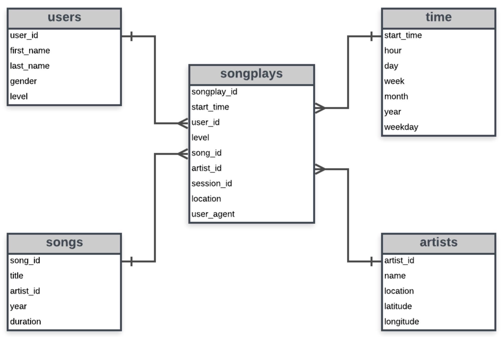

# Project 1: Data modeling with Postgres

This **Udacity Data Engineering nanodegree** project creates a postgres database `sparkifydb` for a music app, *Sparkify*. The purpose of the database is to model song and log datasets (originaly stored in JSON format) with a star schema optimised for queries on song play analysis. The aim of the project is get acquainted with a data modelling schema in and around the given data.

## About the Data

The *Sparkify* app database will be populated using primarily two datasets, **Song Dataset** - which comprises of song and artist details, this dataset is also a subset
of the original [Million Song Dataset](https://labrosa.ee.columbia.edu/millionsong/) and **Log Dataset** which is a generic dataset user level log data developed using
this [event simulator](https://github.com/Interana/eventsim).

> All the data is present in json format and required minor data preprocessing in pandas which can be found in `etl.ipynb`

## Schema design and ETL pipeline

Plan is to use a star schema consisting of a fact table which would hold log metric data and dimension table for artists, songs, users and timestamps respectively

Details about the tables -

**Fact Tables**:

* songplays_f - records in log data associated with song plays i.e. records with page NextSong

**Dimension Tables**:

* users_d - users in the app
* songs_d - songs in music database
* artists_d - artists in music database
* timestamps_d - timestamps of records in songplays broken down into specific units



*Side note - All the etl pipeline building happens in `etl.py`*

## Project file details

The entire project uses `python` for data processing and handling and `psycopg2` library to talk with PostgreSQL

* `sql_queries.py` - Holds all the raw sql queries which include `DROP`, `CREATE`, `INSERT`, and `SELECT` queries, we also have a query for small data quality check. This file is and will be the source for all the raw sql queries in the future.

* `create_tables.py` - This is where we run the `CREATE` statments to buildup the star-schemed database for *sparkify*

* `etl.py`  - Entire ETL pipeline logic resides in this script. All validation checks also done here.

Project run strategy would be to run `create_tables.py` and then `etl.py`, this would make all the data ready and loaded for further analysis.

> Needless to say there are various ways to preprocess and load data into the tables. For that reason `etl.ipynb` can be used as a playground to deal with various other data intricacies and `test.ipynb` to verify that all the processes completed previously ran as required. `test.ipynb` also has magic sql cells setup as `%sql` which could be used to design adhoc queries.

## Sample Analytics queries

#### Total different artists and songs in the database:
```sql
        select 
            count(distinct sq.artist_name) artist_cnt, 
            count(distinct sq.title) song_cnt 
        from 
            (
                select 
                    a.artist_name, 
                    s.title
                from 
                    songs_d s 
                    left join artists_d a 
                    on s.artist_id = a.artist_id
            ) sq;
```

#### Top 5 location where users belong to the free tier of sparkify;
```sql
        select 
            location, 
            count(distinct user_id) user_cnt 
        from 
            songplay_f 
        where 
            level = 'free' 
        group by 
            location 
        order by 
            user_cnt desc 
        limit 5;
```

#### Some more deep dive into level based demographics on our user data: 
```sql
        select 
            sq.level, 
            count(distinct sq.user_id) user_cnt, 
            count(distinct sq.session_id) session_cnt, 
            sq.gender 
        from 
            (
                select 
                    s.level, 
                    s.user_id, 
                    s.session_id, 
                    u.gender 
                from 
                    songplay_f s 
                    left join users_d u 
                    on u.user_id=s.user_id
            ) sq 
        group by 
            sq.level, 
            sq.gender 
        order by 
            gender;
```